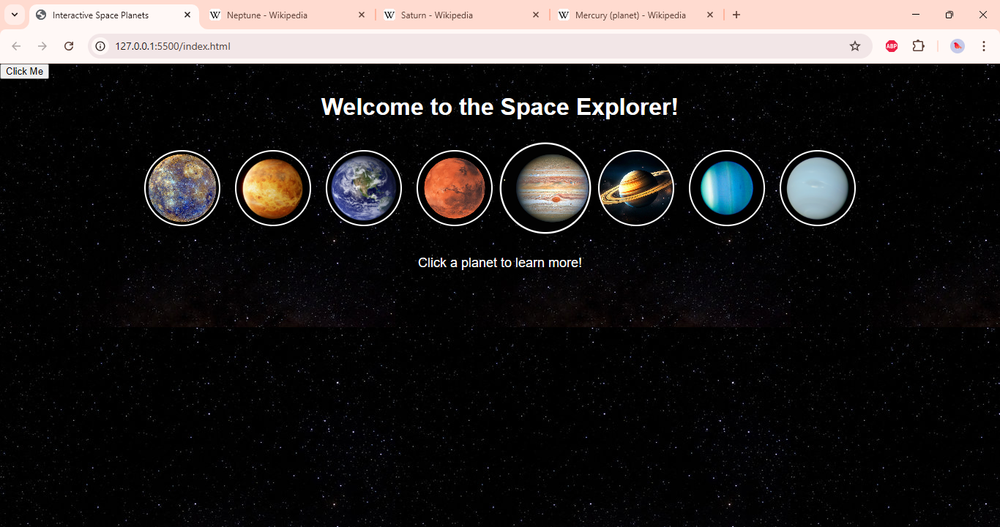

# Apexplanet-task1
🌌 Interactive Space Planets

This project is part of my ApexPlanet Internship – Task 1.
It is a simple interactive web page where you can explore the planets of our solar system.

🚀 Features

Beautiful space background 🌌

Clickable planets with images 🪐

Displays planet information dynamically

Direct links to learn more on Wikipedia

Responsive layout with hover effects

🛠️ Technologies Used

HTML5

CSS3 (animations, hover effects, responsive styling)

JavaScript (interactive info display)

📂 Project Structure

├── index.html    # Main project file

├── background.jpg    # Space background (local or online)

└── README.md         # Documentation

📸 Demo Screenshot

🔗 Live Links

🌐 LinkedIn Video Post
[Watch Demo Here](https://www.linkedin.com/posts/harshini-pulugurtha_apexplanet-internship-frontend-activity-7375425571947864065-WnMZ?utm_source=share&utm_medium=member_desktop&rcm=ACoAAEN1RX4BlL_IutP1rHCeyqfXw3vsoeUxF0U)  

💻 GitHub Repository
[My ApexPlanet Task 1 Repo](https://github.com/Harshini-Pulugurtha/Apexplanet-task1)

📖 How to Run

Clone the repository:

git clone https://github.com/Harshini-Pulugurtha/Apexplanet-task1.git

Open index.html in any modern browser.

That’s it! 🎉
